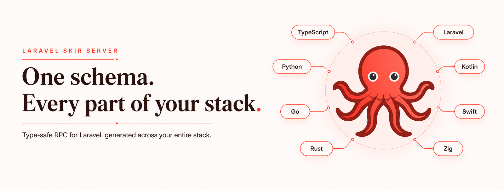

# Laravel Skir Server

[](https://github.com/php-skir/server/actions/workflows/tests.yml)
[](https://github.com/php-skir/server/actions/workflows/tests.yml)
[](https://packagist.org/packages/php-skir/server)
[](https://packagist.org/packages/php-skir/server)
[](LICENSE)

Laravel package for exposing SkirRPC methods from a Laravel application.

## Why Skir?

[Skir](https://skir.build/) is a modern schema language for defining data models and APIs. You describe your structs, enums, and RPC methods once in `.skir` files, then generate clean, idiomatic, and type-safe code across your stack. Skir includes generators for TypeScript, Python, Java, Go, C#, C++, Kotlin, Rust, Swift, and more, while the PHP generators in this ecosystem bring the same schema-first workflow to Laravel. This gives your backend, frontend, and other services a shared source of truth instead of separately maintained DTOs and API contracts.

SkirRPC offers many of the same benefits as gRPC—shared method definitions, generated clients and servers, and end-to-end type safety—but runs over standard HTTP requests and integrates with the frameworks you already use. This package brings that workflow to Laravel: generated contracts handle serialization and type information, while your procedures remain ordinary Laravel controllers resolved through the container.

## Features

- Generate typed server contracts with either the Laravel Data or standard PHP generator. See [Generated procedures](docs/generated-procedures.md).
- Route procedures to attributed Laravel controllers, invokable controllers, generated providers, or manual handlers. See [Routing](docs/routing.md).
- Inspect an endpoint's procedures through its opt-in Studio. See [Studio](docs/routing.md#studio).
- Select dense JSON, standard JSON, base64 dense JSON, or CBOR per endpoint. See [Codecs](docs/codecs.md).

## Quick start

Install the server package and the Laravel Data generator:

```bash
composer require php-skir/server spatie/laravel-data
npm install --save-dev skir skir-laravel-data-generator
```

Define a Skir method:

```skir
// skir-src/admin/users.skir
struct GetUserRequest {
  user_id: int32;
}

struct User {
  user_id: int32;
  name: string;
}

method GetUser(GetUserRequest): User = 3180856469;
```

Configure the generator in `skir.yml`:

```yaml
generators:
  - mod: skir-laravel-data-generator
    outDir: skir/skirout
    config:
      namespace: Skir
```

Skir requires every output directory to end in `/skirout`. It owns that directory and may replace or remove files inside it, so keep handwritten application code elsewhere.

Generate the PHP contracts, configure Composer, and refresh the autoloader:

```bash
npx skir gen
npx skir-laravel-data-generator configure-composer
composer dump-autoload
```

The `configure-composer` command reads `skir.yml` and adds this PSR-4 mapping to `composer.json` when it is missing:

```json
{
  "autoload": {
    "psr-4": {
      "Skir\\": "skir/skirout/"
    }
  }
}
```

Keep controllers in the application-owned `App\Http\Skir` namespace and import the generated `Skir` classes:

```php
<?php

declare(strict_types=1);

namespace App\Http\Skir;

use App\Models\User as UserModel;
use Skir\Admin\AdminSkirMethod;
use Skir\Admin\GetUserRequestData;
use Skir\Admin\UserData;
use Skir\Server\Attributes\SkirMethod;
use Skir\Server\SkirContext;

final class UserController
{
    #[SkirMethod(AdminSkirMethod::GetUser)]
    public function get(GetUserRequestData $request, SkirContext $context): UserData
    {
        $user = UserModel::query()->findOrFail($request->userId);

        return new UserData(
            userId: $user->id,
            name: $user->name,
        );
    }
}
```

Register the controller on a SkirRPC endpoint:

```php
use App\Http\Skir\UserController;
use Illuminate\Support\Facades\Route;
use Skir\Server\Facades\Skir;

Route::skirRpc('/api/skir', [
    Skir::controller(UserController::class),
])->studio();
```

Only public controller methods carrying a `SkirMethod` attribute are registered. The generated enum case identifies the Skir method; the PHP method name does not.

The `studio()` call enables the endpoint-scoped Studio at `/api/skir?studio`. Studio is disabled unless it is enabled on the route. See [Routing and Studio](docs/routing.md#studio) for the available routing layouts and alternatives.

## Optional client package

The [`php-skir/client`](https://github.com/php-skir/client) package is not required to host a SkirRPC server. It normally belongs in the application consuming this endpoint. See [Generated procedures](docs/generated-procedures.md#optional-artisan-wrapper) for its optional generator wrapper.
